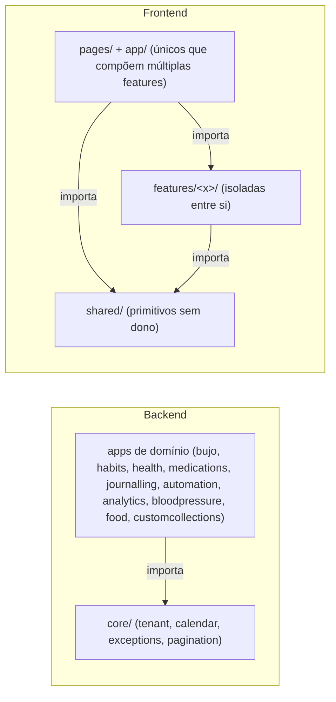

# Architecture Spine — hmmb-bujo

_Distilado em 2026-07-29 a partir do Architecture Decision Document bmad v8 (1865 linhas, AD-01 a AD-29, completo e implementado até a Story 14.10). Este spine preserva toda decisão que ainda restringe código novo; contexto, rationale de descarte e casos-âncora de cada AD ficam no documento original arquivado (referenciado acima) — este documento é o contrato vigente, não o registro histórico da deliberação._

## Design Paradigm

Monolito Django por domínio (um app por bounded context: `bujo`, `habits`, `health`, `medications`, `gratitude`/`journalling`, `braindump`, `automation`, `analytics`, `bloodpressure`, `food`, `customcollections`) com **camada de serviço obrigatória** entre view e model — toda regra de negócio e toda transação mora em `<app>/services.py`, nunca em views/signals/serializers. `core/` é infraestrutura pura (tenant, tempo, erros, paginação) e **nunca importa um app de domínio** — grafo de dependência acíclico, imposto por import-linter no CI.

Frontend: React SPA "feature-sliced" — `features/<domínio>/` isoladas (nunca se importam entre si; expõem só um barrel `index.ts`), compostas exclusivamente por `pages/` e `app/` (chrome/rotas/providers). Estado de servidor vive inteiramente no cache do TanStack Query; nenhum store de cliente duplica o que o servidor já sabe.

## Invariants & Rules

Grafo de dependência entre módulos (a regra de porta do `core` e o isolamento de `features/`):



### AD-01 — Schema Dinâmico: estratégia diferenciada por entidade

- **Binds:** FR-2 (Hábitos), FR-3 (Saúde), FR-3.4-3.7 (Medicamentos)
- **Prevents:** schema EAV genérico ou JSONB indiscriminado que degrada queries históricas e força validação ad-hoc espalhada
- **Rule:** Hábitos e Medicamentos usam tabelas normalizadas com colunas tipadas. Métricas de saúde (campos definidos pelo usuário em runtime) usam JSONB (`health_logs.values`, indexado por UUID de `health_field_definitions`), validado **só na camada de serviço** contra as definições ativas — nunca no banco. Leitura analítica faz cast explícito via operadores JSONB (nunca confia em "a chave é UUID, não precisa converter"). Sem view materializada e sem índice JSONB até performance exigir (latitude reservada, não construir preventivamente).

### AD-02 — Máquina de Estados de Tarefas

- **Binds:** FR-1 (todo ciclo de vida de `tasks`, inclui subtarefas AD-08 e instâncias de recorrentes AD-08)
- **Prevents:** implementações divergentes de transição de status por ausência de matriz formal
- **Rule:** `tasks.status` ∈ `{pending, started, completed, cancelled, migrated, postponed}` segue estritamente a matriz de transições: `migrated`/`postponed` são **terminais** no log de origem; `completed` reabre só por clique (→`pending`); `cancelled` desfaz só por edição manual (→`pending`); migração/adiamento **só** via Fluxo de Migração, nunca por clique direto no status. Validação em duas camadas: ENUM no Postgres (via TextChoices+CheckConstraint, ver Consistency Conventions) **e** lógica de transição no service — nenhuma delas sozinha basta.

### AD-03 — Rastreamento de Linhagem de Tarefas

- **Binds:** FR-1 (toda migração de task)
- **Prevents:** perda de rastreabilidade de linhagem; ambiguidade sobre em qual container uma task vive
- **Rule:** migração preserva o registro original (`status=migrated`) e cria um sucessor com `migrated_to_task_id` apontando para ele; o sucessor herda `migration_count+1` e (AD-18) **herda o status da origem** — não nasce sempre `pending`. `tasks` tem exatamente um de `log_id`/`weekly_log_id`/`monthly_log_id` preenchido (CHECK `task_exactly_one_log`); subtarefas herdam o container do pai. Tanto `migrated` quanto `postponed` incrementam `migration_count`.

### AD-04 — Contrato Temporal Implícito

- **Binds:** todos os apps que lidam com "que dia é hoje" ou gravam timestamp
- **Prevents:** cada módulo inventando sua própria interpretação de fuso/data; auto-migração/cron fantasma
- **Rule:** servidor (UTC) é autoridade do instante; `users.timezone` (IANA, nunca offset numérico) é autoridade da zona. **Única função de "hoje": `today_for(user)` em `core/calendar.py`** — nenhum módulo chama `date.today()`/`timezone.now().date()` diretamente (guardrail de CI/teste de arquitetura). Duas categorias de coluna: `timestamptz` para instantes de evento/auditoria, `DATE` puro para a "página do diário". Dia lógico da sessão congela na abertura da página (sem auto-refresh de meia-noite em sessão ativa). Sem cron de fechamento de dia, sem migração automática — reconciliação é sempre ato deliberado do usuário (AD-09).

### AD-05 — Semântica de Calendário (Semana / Mês / Ano)

- **Binds:** FR-1 (Weekly/Monthly/Future Log)
- **Prevents:** duplicação de dados na semana de virada de mês/ano; ordinais `(ano, mês, semana_n)` divergentes
- **Rule:** segunda-feira é o primeiro dia da semana; a primeira semana de um mês/ano é a que contém o dia 1 (diverge do ISO-8601 deliberadamente). `weekly_log` chaveado por `week_start` (sempre segunda, `CHECK EXTRACT(ISODOW)=1`); `monthly_log` chaveado por `month_first` (sempre dia 1, `CHECK EXTRACT(DAY)=1`). Pertencimento a mês/ano é **derivado na leitura**, nunca armazenado como ordinal — a semana de virada é uma única linha compartilhada por duas visões mensais. **Future Log não é entidade separada** — é `monthly_log` com `month_first` futuro; `POST /api/bujo/logs/monthly/` é o único write path.

### AD-06 — Snapshot de Hábitos: materialização ansiosa + timeline de configuração

- **Binds:** FR-2 (completude ponderada, histórico por hábito)
- **Prevents:** peso/meta/bonus retroagindo sobre dias já registrados; denominador de completude incorreto quando hábito não-marcado
- **Rule:** duas camadas — `habit_versions` (config prospectiva, timeline por `effective_from`; estado em D = versão com `max(effective_from) <= D`) e `habit_day_entries` (snapshot realizado, congelado, editável por dia; grão `(user_id, habit_id, date)`). Materialização **ansiosa na 1ª abertura do dia**: uma linha por hábito ativo em D, semeada da versão vigente **naquele dia** (não a de hoje). Denominador de completude = todas as linhas de `habit_day_entries` do dia. Hábito ativo sem valor = 0% e **entra** no denominador; hábito inativo não tem linha e **não entra**. Edição avulsa de um dia passado faz `UPDATE` só naquela linha — nunca toca `habit_versions` (NFR-4: sistema nunca retroage, usuário edita o que quiser).

### AD-07 — Modelo de Medicamentos: slot estável + blocos dinâmicos + versionamento duplo

- **Binds:** FR-3.4-3.7
- **Prevents:** confundir ausência de dose (evento clínico) com "não feito" de hábito; perder histórico de adesão ao trocar substância/laboratório
- **Rule:** grão do log = `(medicamento, bloco, data)`; confirmação de bloco inteiro é escrita em lote das linhas do bloco, "confirmado" é sempre **derivado**, nunca armazenado. Bloco de horário é tabela dinâmica por usuário (`time_blocks`), sem ENUM, sem papel restritivo. Dois eixos de versão independentes: `medication_schedule_versions` (dose por bloco) e `medication_substance_versions` (substância/laboratório/médico) — trocar uma não precisa tocar a outra. `medication_day_entries` materializa ansiosamente (mesma disciplina da AD-06) com `dose_at_time` congelado e `source ∈ {scheduled, ad_hoc}` — ausência de linha `scheduled` num dia passado é **dose perdida** (sinal clínico), nunca um "0% de denominador" como em hábito.

### AD-08 — Tarefas Recorrentes (template + instância congelada) e Subtarefas

- **Binds:** FR-1.11, FR-1.12, FR-1.3
- **Prevents:** edição de template retroagindo sobre instâncias já colocadas; cascata automática de conclusão entre pai/filhos
- **Rule:** `recurring_task_templates` é tabela separada, sem status, sem ciclo de vida. Placement gera uma `task` real (snapshot, nunca referência viva) com `source_template_id` apontando à origem; editar o template só afeta placements futuros. `recurrence_text` é texto livre, **nunca parseado** — sem auto-placement. Exclusão de template é lógica (`deleted_at`), nunca física — preserva a linhagem via `source_template_id`. Subtarefa = `task` com `parent_task_id` (árvore auto-referencial, mesma estrutura, mesma máquina de estados AD-02); status do pai e dos filhos **nunca cascateiam automaticamente**; fechamento de log exige que a subárvore inteira tenha disposição; migração de um pai recria no destino só os filhos ainda não dispostos, cada nó seguindo AD-03 individualmente.

### AD-09 — Catch-Up / Log Órfão: migração generalizada, detecção por query

- **Binds:** FR-1 (revisão semanal/mensal, reconciliação de dias pulados)
- **Prevents:** cron de auto-migração; acúmulo de "N migrações" por um único período de ausência
- **Rule:** Catch-Up é o Fluxo de Migração (AD-02/AD-03) generalizado — muda só a fonte: "tarefas sem disposição em qualquer log com data < hoje", detectada **por query, sem estado acumulado, sem cron**. Gatilhos de revisão são por condição ("existe log anterior com pendências?"), nunca por data fixa. Ordem hierárquica de apresentação: mês → semana → dia. `migration_count` incrementa **uma vez por decisão de reconciliação**, independente de quantos dias de calendário foram pulados. Dias pulados nunca materializam nada (sem `habit_day_entries`/`medication_day_entries`) — são lacuna honesta, nunca 0% fabricado.

### AD-10 — Pesos Diferenciados por Tipo de Dia

- **Binds:** FR-2.1 (grupos de hábito)
- **Prevents:** multiplicador de fim de semana/feriado sangrando para dias vizinhos ou se confundindo com mudança real de peso
- **Rule:** multiplicador vive no **grupo** (não no hábito), por `day_type ∈ {weekend, holiday}` (weekday implícito = 1.0), com precedência `holiday > weekend > weekday` sem acumular. `habit_day_entries` congela `day_type` e `multiplier_at_time` **separado** de `weight_at_time` (nunca grava o produto) — peso efetivo = `weight_at_time × multiplier_at_time`, resolvido e congelado na materialização (AD-06). Config do multiplicador é versionada e prospectiva, mesma disciplina de `habit_versions`.

### AD-11 — Apresentação de Mudanças de Peso: anotação por stream de versões

- **Binds:** FR-2.5, FR-2.10 (gráfico de evolução de hábitos)
- **Prevents:** confundir mudança real de config (evento datado) com ritmo periódico de fim de semana/feriado (estilo, não evento)
- **Rule:** mudanças reais são **sempre anotadas, nunca silenciadas** — `habit_versions` é a fonte de um stream de eventos datados (peso/meta/bonus/ativação), cada nova versão com `effective_from` é um ponto de anotação. `day_type`/`multiplier_at_time` (AD-10) são estilo/sombreamento no gráfico, **nunca** um marcador de "peso mudou". Sem tabela nova — política de read-path sobre `habit_versions` + `habit_day_entries` já existentes.

### AD-12 — Isolamento Multi-Tenant na Camada de Aplicação [ADOPTED]

- **Binds:** `all` (toda tabela tenant, todo endpoint)
- **Prevents:** vazamento de dados entre usuários; RLS no Postgres bloqueando acesso legítimo de operador/admin
- **Rule:** isolamento **autoritativo na camada de aplicação**, sem RLS no Postgres. Todo model tenant tem `objects` = `TenantManager` auto-escopado por `current_user_id` (contextvar), setado por middleware logo após auth JWT e resetado no `finally`. **Fail-closed sempre:** contextvar vazio → `TenantScopeViolation` (nunca retorna tudo). Acesso de operador/admin usa `Model.all_objects` (não-escopado), caminho explícito e raro, nunca no fluxo de usuário final. Fora de request (commands, workers, seeding, testes): obrigatório `with tenant_context(user):`. Teste de regressão obrigatório por app: query sem contexto **deve** levantar `TenantScopeViolation`, nunca retornar vazio.

### AD-13 — Estado do Frontend: server state derivado via TanStack Query

- **Binds:** todo estado do frontend cuja verdade mora no backend (badge do Brain Dump é o caso-âncora)
- **Prevents:** segunda fonte de verdade em store de cliente divergindo do servidor
- **Rule:** contadores/indicadores cuja verdade é o Postgres são **server state derivado** via TanStack Query (v5), nunca um store de cliente. Mutações invalidam a chave correspondente (nunca `+1/-1` manual espalhado). Estado de UI efêmero (modais, seleção) fica em Context/estado local — nunca misturado com server state. `userId` entra na query key (evita colisão em navegador compartilhado); `queryClient.clear()` no logout.

### AD-14 — Escopo do NFR-2: só o modo de execução diária

- **Binds:** NFR-2
- **Prevents:** super-otimizar planejamento/analítico onde não há requisito real; falsa promessa de "instantâneo" fora do hot path
- **Rule:** `< 2s` percebido aplica-se **exclusivamente** ao modo de execução diária (Daily Log, marcação de hábito/saúde/medicamento, migrações). Planejamento (Weekly/Monthly/Future) e revisão histórica/analítica **não têm NFR de performance formal** — latitude reservada (índices, view materializada, endpoint agregado) só se o tempo de resposta virar problema real.

### AD-15 — Antecipação do Brain Dump (Fase 1b)

- **Binds:** FR-5
- **Prevents:** captura mobile sem válvula de escape nos primeiros estágios do produto
- **Rule:** Brain Dump entra na Fase 1b (logo após o Daily Log), não na Fase 5 — dependências mínimas são só auth (FR-0) + Daily Log existir.

### AD-16 — "Mover para Hoje", balde sem dia, navegação de logs passados não-fechados

- **Binds:** FR-1 (fluxo de Mover/Migrar)
- **Prevents:** "hoje" sempre caindo em placement semanal; pendências em logs passados abertos ficarem inalcançáveis
- **Rule:** o seletor de Mover oferece **"Hoje" como destino explícito ao Daily Log** (`destination='today'`, container `log`), distinto de escolher um dia no calendário (placement semanal). Seletor de Mover também oferece semana/mês **sem dia**. Seletor de Mover exige confirmação explícita (botão "Migrar") — escopo limitado a ele; o Fluxo de Migração de fim-de-dia mantém confirmação automática dos pickers. Passado **aberto** é navegável e acionável; passado **fechado** é read-only (`_check_container_open` é a única fronteira de escrita).

### AD-17 — Manifest/Registry de Collections

- **Binds:** FR-1 (taxonomia núcleo + collections), navegação (Sidebar/BottomNav/router)
- **Prevents:** collection nova exigindo mudança em múltiplos pontos do chrome; server state no registro forçando mocks de Query nos testes compartilhados do chrome
- **Rule:** registro estático de frontend (`app/collections/registry.ts`) — **dados puros: sem hooks, sem TanStack Query, sem side effects.** Uma entrada por collection: `{id, name, icon, routes, nav, archetype, dashboardCard?, settingsSchema?}`. Navegação (Sidebar/BottomNav/rotas de collection) é **map puro** sobre o registro — DoD estrutural: collection nova = pasta da feature + UMA entrada no registro, sem tocar chrome. Núcleo BuJo fica **fora** do registro (não-gateável por construção). Flags de ativação nunca são campo do registro — são consulta separada que **filtra** o registro. Exceção deliberada (AD-22): filhas dinâmicas de um container podem ter server state confinado ao próprio grupo — nesse caso a story registra obrigatoriamente mocks de Query nos 3 testes compartilhados (`AppLayout`/`router`/`RouteAnnouncer`).

### AD-18 — Herança de status na migração e flag `waiting_on`

- **Binds:** FR-4.15/4.16, agregado Task (**congelado** — enum de 6 estados não muda)
- **Prevents:** sucessor de migração perdendo o `/` de "iniciado"; `waiting_on` virar um 7º estado
- **Rule:** sucessor de migração **herda o status da origem** (`started`→`started`, `pending`→`pending`), não nasce sempre `pending`; regra de service, sem tocar a matriz da AD-02 (só `pending`/`started` são migráveis). Subtarefas recriadas herdam o **próprio** status, não o do pai. `waiting_on BOOLEAN` é anotação **ortogonal ao estado** — proibido criar estado novo; transições de status nunca alteram a flag; sucessor de migração herda `waiting_on` da origem.

### AD-19 — Plataforma de Automação (C5): AutomationToken

- **Binds:** FR-3 (captura/resumo via atalhos externos)
- **Prevents:** JWT de sessão frágil em automações externas; token pleno reaparecendo em log ou listagem
- **Rule:** app `automation` dedicado; `AutomationToken` opaco, longa duração, escopado, revogável, **sem refresh**; só o **hash** (SHA-256) é armazenado, token pleno exibido uma única vez na criação. Auth class dedicada valida hash+escopo, seta o tenant context (AD-12) com o dono do token, nunca emite sessão/JWT. Token **nunca aparece em log** (só o prefixo). Rate limiting + auditoria por chamada desde o início.

### AD-20 — Journalling: campos user-defined + três âncoras temporais

- **Binds:** FR-10 (absorve Gratidão)
- **Prevents:** múltiplas âncoras temporais simultâneas numa entrada; contexto de IA vazando sem consentimento por campo
- **Rule:** app `journalling`, padrão "coded com campos user-defined" (mesmo padrão do Épico 7/Saúde). `journal_entries` tem três âncoras (`entry_date`/`week_start`/`occurred_at`) **mutuamente exclusivas conforme a cadência do campo** (CHECK exactly-one, mesmo padrão de AD-03/AD-20). Ciclo de vida de campo = editar seguro × destrutivo (mudar cadência/remover é só desativação, histórico preservado). `ai_context` é opt-in por campo, default **off** — só campos com `ai_context=on` entram no catálogo de Análises (AD-25).

### AD-21 — Home: componente único compartilhado (Hoje + Dashboard)

- **Binds:** FR-6
- **Prevents:** duas implementações divergentes das tasks do dia em Hoje vs. Dashboard; estado duplicado entre as duas pages
- **Rule:** **um** componente de visualização/manipulação das tasks do dia, em `features/bujo/`, consumido por **duas** pages (`pages/today/`, `pages/dashboard/`) com capacidade plena e idêntica nas duas. Ambas leem as mesmas query keys — zero estado duplicado. Delta explícito na regra de barrel: `features/bujo` pode expor esse componente de composição designado (além de api+hooks+types).

### AD-22 — Custom Collections (C6): schema por collection, JSONB, 1 nível

- **Binds:** FR-14
- **Prevents:** aninhamento arbitrário de sub-registros; server state vazando para o registro estático do chrome
- **Rule:** app `customcollections`; definição de schema tipado (`custom_collections.schema` JSONB) + registros (`custom_collection_records.data` JSONB), validados na camada de serviço (nunca no banco, mesmo padrão AD-01). Sistema de tipos próprio, campo `subrecords` aceita **só escalares** — aninhamento máx. 1 nível é fronteira dura, validada no service. Edição de schema com registros existentes = editar seguro × destrutivo. Filhas dinâmicas na sidebar usam server state **confinado ao grupo do container** (exceção deliberada à AD-17) — a story registra obrigatoriamente mocks de Query nos 3 testes compartilhados.

### AD-23 — Alimentação: espelho local read-only, fotos referenciadas

- **Binds:** FR-11
- **Prevents:** falha do foodLog externo quebrando o bujo; binários de foto duplicados localmente
- **Rule:** app `food` mantém um **espelho** (`food_log_entries`) sincronizado on-read com TTL, **sem scheduler no MVP**; falha de sync nunca quebra o núcleo — superfície renderiza o espelho existente com "última sincronização há X". Fotos são **sempre referenciadas** (URL do bucket Cloudflare original), **nunca copiadas** como binário. Análises lê só do espelho local, nunca da API externa; fotos nunca entram como contexto de IA.

### AD-24 — Configuração de IA global: BYO key criptografada

- **Binds:** FR-2 (gateia Análises, PA foto+IA, `contexto_ia`)
- **Prevents:** chave de API em texto puro no banco ou em log; uso de provedor que treina com o conteúdo do usuário
- **Rule:** `user_ai_settings` (1:1 por usuário) guarda a chave **criptografada em repouso** (Fernet, chave dedicada em env, distinta de `SECRET_KEY`). API é **write-only**: `PUT` aceita a chave, `GET` devolve só máscara. Chave plena **nunca aparece em log**. `ai_available` é capability derivada que gateia todo fluxo de IA. **Allowlist de providers no backend** — só provedores com política verificada de não-treino (Gemini free tier proibido por construção, não por convenção).

### AD-25 — Análises: catálogo allowlist + DSL compilado para ORM

- **Binds:** FR-13, NFR-7
- **Prevents:** SQL gerado/executado por IA (OWASP LLM01/LLM05); IA produzindo números em vez de referenciar séries computadas pelo backend
- **Rule:** **invariante de arquitetura, não de story: a IA nunca gera nem executa queries e nunca produz números.** `analytics/catalog.py` é a allowlist única de métricas (métrica fora do catálogo não existe para o sistema). Modelo de Relatório persiste uma **spec JSON** validada por JSON Schema estrito + allowlist, compilada server-side para QuerySets — a IA (ou o usuário) só produz/edita a spec, nunca toca o banco. Caminho de leitura de relatórios usa alias de banco `report_read` (role read-only + `statement_timeout`) como defesa em profundidade. IA devolve blocos que **referenciam séries por `serie_ref`**, nunca embute dados. `report_generations` grava snapshot imutável por geração (nunca UPDATE). Coleção-fonte desligada oculta métricas do catálogo, nunca deleta snapshots antigos.

### AD-26 — Análises fase c: agendamento com django-q2, controle de custo

- **Binds:** FR-13.10 (só entra após fases a/b de AD-25)
- **Prevents:** gasto de BYO key sem teto; nova infra (Redis/RabbitMQ) para um scheduler simples
- **Rule:** **django-q2** com broker no ORM/Postgres (zero infra nova); worker `qcluster` como serviço separado, tarefas fora de request usam `tenant_context(user)` explícito. Cap mensal configurável (`monthly_cap_usd`) checado antes de gerar — excedido → **pula e registra**, nunca gera silenciosamente acima do cap. Skip por hash: `payload_hash` igual ao da última geração → não gera (dados não mudaram).

### AD-27 — Pressão Arterial: par atômico, human-in-the-loop obrigatório

- **Binds:** FR-12, NFR-8
- **Prevents:** vision LLM alucinando valores plausíveis a partir de foto ilegível; foto salva direto sem confirmação humana
- **Rule:** `bp_measurements.systolic`/`diastolic` sempre na **mesma linha** (nunca registros separados); `source ∈ {photo_ai, manual, import}` **desde a 1ª migration** (caminho de import futuro preparado, não implementado). Fluxo foto+IA é **obrigatoriamente human-in-the-loop**: crop+strip de EXIF no cliente antes do upload; IA devolve structured output com instrução explícita de recusa (`null` em vez de adivinhar); formulário pré-preenchido com badge de confiança por campo; **salvar só após confirmação explícita**; fallback manual sempre visível. Validação server-side de plausibilidade (`CHECK systolic > diastolic`, ranges) roda **independente** da IA — confirmação humana não a substitui. Fotos em bucket R2 **privado**, servidas só por endpoint autenticado tenant-scoped com URL presignada de curta duração — nunca URL pública/estática.

### AD-28 — Ciclo de vida Weekly/Monthly em colunas + ritual_decisions + fila unificada

- **Binds:** Épico 14 (M06-M10), migração/catch-up (AD-09)
- **Prevents:** tabela satélite de ciclo duplicando `(user, week_start)`/`(user, month_first)`; decisão-snapshot criando segunda verdade sobre um item já mutado; fila de migração com estado acumulado
- **Rule:** estado do ciclo é **coluna no próprio log** (`status ∈ {planning, active, finalized}` NULL-able + `planning_completed_at` timestamp), nunca tabela satélite — `WeeklyLog`/`MonthlyLog` já são o ciclo 1:1 (AD-05). `status IS NULL` = fora do regime operacional (terceira semântica, não "none"). Unicidade de **no máximo um** `active` e um `planning` por tipo via `UniqueConstraint` parcial — corrida vira `IntegrityError`→`CycleTargetConflict` (409, distinta de `InvalidTransition`). Transições só por service explícito, idempotente, nunca por materialização (`get_or_create_*_log` nunca atribui estado). `finalized` é terminal, sem transição de saída. `ritual_decisions` registra **só** decisões que não mutam o item (`keep`/`skip_week`/`keep_undated`); decisões mutantes (migrar/concluir/cancelar) **não** ganham registro paralelo — a mutação já é a persistência. Âncora exclusiva de alvo (`weekly_log` XOR `monthly_log`) e de item (`task` XOR `recurring_template`). Fila unificada de migração é **100% derivada por query, zero schema novo** (mesma filosofia AD-09) — decisão por item usa os services existentes, herança de status/`waiting_on` reusa a regra da AD-18.

### AD-29 — Coexistência do design system: shell novo por rota, tokens `--ds-*`

- **Binds:** Onda 2a (Épico 13), migração de design system
- **Prevents:** repintar `theme.ts` (paleta legada, consumida por ~20 superfícies não migradas) de uma vez; toggle de usuário criando dois caminhos permanentes
- **Rule:** coexistência é **por rota**, declarativa, em dados puros (`shellRouting.ts`: `{routeId, shell: 'new'|'legacy', surfaceMigrated}`) — sem hooks, sem TanStack Query, sem env. `ProtectedLayout` escolhe `ShellLayout` ou `AppLayout` legado por essa entrada; **rollback = trocar uma palavra numa linha**. Sem toggle Legado/Moderno e sem feature flag. Tema novo entra por **camada de tokens CSS `--ds-*`** (`shared/design/tokens.ts`, dados puros) aplicada só na raiz do shell — nunca por `ThemeProvider` aninhado (vazaria por herança de contexto) e nunca reescrevendo `theme.ts` (só na consolidação, Épico 18). Chrome novo (`app/layout/shell/`) **não consome TanStack Query diretamente**; contagem/captura entram só via barrel de `features/braindump`.

## Consistency Conventions

| Concern | Convention |
| --- | --- |
| Naming (DB) | Tabelas `snake_case` plural; colunas `snake_case`; FK = `<entidade>_id`; PK = `UUID` (uuid4). Valores fechados via `TextChoices` + `CheckConstraint` no banco — **nunca ENUM nativo do Postgres**. Migrations com `--name` descritivo obrigatório, nunca `auto_<timestamp>`. |
| Naming (API) | Recurso no plural REST (`kebab-case` quando composto); prefixo `/api/` em tudo; query params em `camelCase`. |
| Naming (código) | Python: `snake_case`/`PascalCase`/`UPPER_SNAKE`. React/TS: componente `PascalCase.tsx`, hook `useXxx`, função/variável `camelCase`. |
| Estrutura (backend) | Um app Django por domínio; camada de serviço obrigatória em `<app>/services.py` — funções de módulo (`def <verbo>_<substantivo>(*, user, ...) -> Model`), nunca classes; `user` é sempre primeiro kwarg keyword-only; `@transaction.atomic` decora o **service**, nunca a view. Testes em `<app>/tests/{test_models,test_serializers,test_services,test_views,test_isolation}.py`; `factory_boy` com `user = SubFactory(UserFactory)` em toda factory tenant. |
| Estrutura (frontend) | `features/<domínio>/` isoladas (nunca se importam entre si; barrel `index.ts` só expõe api+hooks+types); `pages/`+`app/` são os únicos que compõem múltiplas features; `shared/` = primitivos sem dono. Tipos da API gerados via `drf-spectacular` → `types.gen.ts` (fonte única). |
| Data & formatos | Casing JSON: `camelCase` na borda (`djangorestframework-camel-case`); `snake_case` interno. **Exceção crítica:** JSONB de chave dinâmica (`health_logs.values` e equivalentes) nunca é convertido em nenhuma direção — via `SerializerMethodField`/ignore explícito. Datas: `DATE`→`"YYYY-MM-DD"`; `timestamptz`→ISO 8601 UTC; entrada naive é rejeitada (400). Listas: paginação padrão DRF (`count/next/previous/results`, `page_size=50`). |
| Erros | Hierarquia `DomainError` em `core/exceptions.py` (`InvalidTransition`, `ImmutableSnapshot`, `TenantScopeViolation`, `CycleTargetConflict`, ...) — proibido levantar `ValidationError`/`ValueError`/`PermissionDenied` cru de dentro de `services/`. Mapa: validação de serializer→400+fields; `DomainError` de regra→409; sem auth→401; recurso de outro usuário→404 (esconde existência); contexto de tenant ausente→**500+alerta** (bug de infra, handler não domestica). |
| Estado & cross-cutting (frontend) | TanStack Query v5 é a única camada de dados — toda leitura via `useQuery`, toda escrita via `useMutation` com invalidação por chave (prefixo `[escopo, entidade]` centralizado em `src/api/keys.ts`, nunca chave inline). Mutação otimista só via wrapper canônico (`onMutate`/`onError`/`onSettled`). Refresh de JWT é **single-flight obrigatório** (uma promise de refresh compartilhada; 401 concorrentes aguardam e fazem retry 1x). |
| Multi-tenant (AD-12) | Fail-closed sempre — contexto vazio nunca vira "todos os usuários". `all_objects` só no caminho de admin explícito, nunca em código de aplicação. Teste de regressão obrigatório por app. |
| Tempo & materialização (AD-04/06/07/09/10) | Toda lógica de tempo/materialização/cálculo de domínio mora na camada de serviço; nunca em serializer/manager/frontend. Materialização ansiosa é sempre método de service idempotente por `(user, date, tipo)`, nunca signal. Única fonte de "hoje": `today_for(user)`. |

## Stack

| Name | Version |
| --- | --- |
| Python | >=3.12 |
| Django | >=5.1,<6.0 |
| Django REST Framework | >=3.15 |
| djangorestframework-simplejwt | >=5.3,<6 |
| djangorestframework-camel-case | >=1.4,<2 |
| django-filter | >=24,<25 |
| django-environ | >=0.11 |
| django-cors-headers | >=4.4 |
| psycopg (binary) | >=3.2 |
| PostgreSQL | Neon (gerenciado, serverless) — branch por ambiente (dev/prod), sem versão própria pinada |
| React | ^19.2.0 |
| TypeScript | ~5.9.0 |
| Vite | ^8.1.0 |
| Material UI | ^6.1.0 |
| TanStack Query | ^5.59.0 |
| Axios | ^1.7.7 |
| @phosphor-icons/react | ^2.1.10 |
| @axe-core/playwright | ^4.12.1 |
| @playwright/test | ^1.61.1 |
| Railway | plataforma de deploy — sem versão própria pinada |
| django-q2 | adicionado na fase c de Análises (AD-26) — verificar versão pinada no `pyproject.toml` ao implementar |
| Recharts | adicionado na fase b de Análises (AD-25) — verificar versão pinada no `package.json` ao implementar |
| cryptography (Fernet) | adicionado com AD-24 — verificar versão pinada no `pyproject.toml` ao implementar |
| django-storages | adicionado com AD-27 (Cloudflare R2) — verificar versão pinada ao implementar |
| Anthropic API (BYO key) | structured outputs + Batch API; default Haiku 4.5 (PA, AD-27) / Sonnet (relatórios, AD-25) — recomendação, não trava |

## Structural Seed

```text
hmmb-bujo/
├── backend/
│   ├── config/settings/{base,dev,prod}.py   # split via django-environ
│   ├── core/                                 # CROSS-CUTTING — NÃO importa app de domínio (regra de porta, import-linter no CI)
│   │   ├── models.py                         # TenantModel abstrata (UUID PK, user_id, objects=TenantManager, all_objects)
│   │   ├── tenant.py                         # contextvar + tenant_context() + TenantManager fail-closed (AD-12)
│   │   ├── middleware.py                     # seta contextvar pós-auth JWT, reset no finally
│   │   ├── exceptions.py                     # DomainError + subclasses + exception handler (Consistency Conventions)
│   │   ├── calendar.py                       # today_for(user), is_workday(user, date) — autoridade única de "hoje" (AD-04)
│   │   └── pagination.py
│   ├── accounts/                             # FR-0 (auth JWT) + FR-6 (multiusuário, pós-MVP) + user_holidays (AD-10)
│   ├── bujo/                                 # FR-1 — dono de Task/Daily/Weekly/Monthly/Future Log, migração, recorrentes (AD-02/03/05/08/09/16/28)
│   ├── habits/                               # FR-2 — habit_versions, habit_day_entries (AD-06/10/11)
│   ├── health/                               # FR-3 métricas genéricas JSONB (AD-01) — sem FK para medications
│   ├── medications/                          # FR-3.4-3.7 — rastreio completo de medicação (AD-07)
│   ├── journalling/                          # FR-10 — absorve gratitude (AD-20); gratitude/ removido na Onda 6
│   ├── braindump/                            # FR-5 (Fase 1b, AD-15)
│   ├── automation/                           # AutomationToken + capture/summary (AD-19) — app de composição
│   ├── customcollections/                    # C6 (AD-22)
│   ├── food/                                 # espelho read-only do foodLog (AD-23)
│   ├── analytics/                            # catalog.py (allowlist) + services/compiler.py (DSL→ORM) + services/metric_index.py (AD-25/26)
│   └── bloodpressure/                        # bp_sessions/bp_measurements/bp_photos (AD-27) — primeira mídia binária (R2)
└── frontend/src/
    ├── api/                                  # client.ts (interceptor refresh single-flight) + keys.ts (query-key factory) + types.gen.ts (drf-spectacular)
    ├── app/                                  # COMPOSIÇÃO COM DONO — router, providers, layout/shell/ (AD-29), collections/registry.ts (AD-17)
    ├── pages/                                # COMPOSIÇÃO DE TELA — único lugar que importa múltiplas features (today/, dashboard/ — AD-21)
    ├── shared/                                # PRIMITIVOS SEM DONO — design/tokens.ts (AD-29), useOptimisticMutation.ts
    └── features/<domínio>/                   # CAMARINS ISOLADOS — nunca se importam entre si; barrel index.ts = api+hooks+types
```

## Deferred

- **Observabilidade mínima antes de multiusuário (Épico 10):** logging estruturado JSON (`python-json-logger`/`structlog`), Sentry (error tracking), Better Stack (uptime/alertas em `/health/`). Bloqueia convite de usuários externos, não o uso solo atual. Ver [[deploy-ar21-done-ar22-observability-pending]].
- **Pinagem/atualização contínua de versões major** (Django, React, MUI, Node LTS): revisitar a cada épico que toque dependências — este spine reflete o `pyproject.toml`/`package.json` em 2026-07-29, não uma trava.
- **View materializada para queries analíticas de saúde/hábitos** (AD-01/AD-14): só se performance perceptível aparecer com o crescimento de dados.
- **Endpoint agregado `/api/daily/{date}/`** (AD-14/§7.3): só se o NFR-2 (<2s) não se sustentar com prefetch paralelo por feature.
- **RLS no Postgres** (AD-12): caminho de upgrade explícito só se o produto abrir para terceiros não-confiáveis (hoje o threat model é admin solo).
- **Regressão visual automatizada por screenshot** (AD-29): descartada deliberadamente (`DIV-14`) enquanto Playwright não rodar no CI; paridade é validada por checklist + axe.
- **Seletor de aparência com múltiplas famílias cromáticas** (AD-29): tipo já cobre 4 famílias, só "Mineral" existe em runtime — Story 18.1.
- **Granularidade de flag de ativação de collection** (AD-17, espaço × usuário): desenho adiado ao Épico 10.
